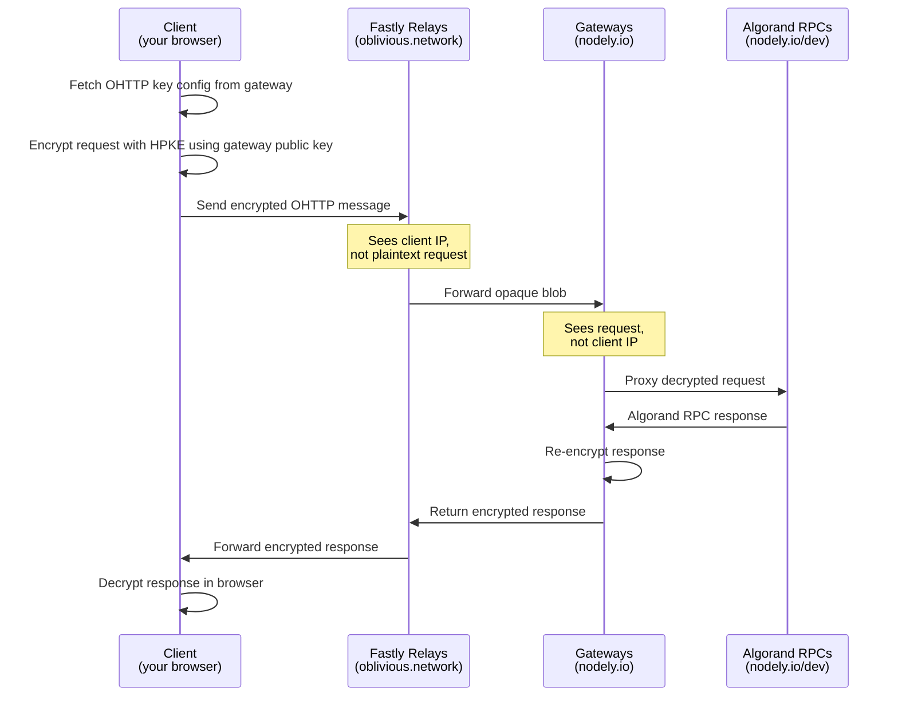

# Algorand OHTTP Demo

A Next.js demo that fetches Algorand testnet node status via **Oblivious HTTP (OHTTP)**, hiding the client's IP address from the API server. It uses `ohttp-js` for HPKE-based request encapsulation, Fastly's relay network, and Nodely's OHTTP gateway in front of their Algorand RPC nodes.

## How it works



### Privacy properties

1. **Encrypt & encapsulate** — the algosdk request is wrapped in an HPKE-encrypted OHTTP message using the gateway's public key. The relay never sees the plaintext.
2. **Relay forwards** — the relay passes the opaque blob to the gateway. It only knows your IP, not what you are querying. Relays are operated by a third party (Fastly) for additional trust separation.
3. **Gateway decrypts & proxies** — the gateway decrypts the message and calls algod on your behalf. It sees the query but not your IP.
4. **Response re-encrypted** — the reply travels back through the relay, still encrypted, and is decrypted only in your browser.
5. **Low traffic service** — optimized for low-volume but sensitive traffic such as mobile and web wallets.

## Architecture

| Component | Provider | Role |
|-----------|----------|------|
| OHTTP Relay | `relay.oblivious.network` (Fastly) | Strips client IP, forwards encrypted blob |
| OHTTP Gateway | `ohttp.nodely.io` | Decrypts requests, proxies to algod |
| Algorand RPC | `testnet-api.4160.nodely.dev` | Algorand node API |
| HPKE library | `ohttp-js` | Client-side request encryption/decryption |

## Live Demo

[https://algorand-anonymous-rpc-demo.vercel.app/](https://algorand-anonymous-rpc-demo.vercel.app/)

## Getting Started

```bash
pnpm install
pnpm dev
```

Open [http://localhost:3000](http://localhost:3000) to see the demo.

Click **Fetch Status** to fire a live OHTTP-encapsulated request to the Algorand testnet and display the node status response.

## Key files

- [app/ohttpAlgodClient.ts](app/ohttpAlgodClient.ts) — implements `BaseHTTPClient` from algosdk using OHTTP transport
- [app/OhttpFetcher.tsx](app/OhttpFetcher.tsx) — React component wiring the client to the UI
- [app/page.tsx](app/page.tsx) — main page with the fetcher and flow diagram
